<div align="center">
  <h1>🚀 IntentGraph</h1>
  <p><b>A universal action OS that compiles natural-language intent into trusted workflows.</b></p>
</div>

<div align="center">



</div>

## 📖 What is IntentGraph?

**IntentGraph** is a cutting-edge Python library that acts as the bridge between messy, unstructured codebases and intelligent AI agents. It rapidly consumes entire project directories, parses the abstract syntax trees, and dynamically maps cross-file dependencies into a **machine-queryable context graph**.

By mapping functions, classes, imports, and modules into structured LLM-friendly schemas, IntentGraph allows agents to natively "understand" your architecture, empowering them to make safer, context-aware decisions before executing tasks.

---

## ✨ Features

- **Blazing Fast Parsing:** Uses Python's native `ast` module to analyze files loss-tolerantly.
- **Robust Dependency Graphs:** Leverages `networkx` to compute complex relational maps of your entire repository.
- **LLM-Optimized Output:** Exports strictly-typed `Pydantic` schemas representing Nodes (Files, Functions, Classes, Modules) and Edges (Imports, Inherits, Calls).
- **Intuitive CLI:** Built with `Typer`, providing a seamless developer experience out of the box.

---

## 💻 CLI Demo

<div align="center">


</div>

---

## 🚀 Installation

IntentGraph uses [Poetry](https://python-poetry.org/) for dependency management.

```bash
# Clone the repository
git clone https://github.com/DARREN-2000/IntentGraph.git
cd IntentGraph

# Install dependencies
poetry install
```

---

## ⚡ Quick Start

### Using the Command Line

To instantly parse a repository and generate a JSON graph:

```bash
poetry run intentgraph parse /path/to/your/project --pretty --output graph.json
```

### Using the API

You can easily integrate IntentGraph into your own Python applications or agent workflows:

```python
from intentgraph.orchestrator import Orchestrator

# Initialize the orchestrator
orchestrator = Orchestrator()

# Parse a directory
graph_data = orchestrator.process_directory("./src")

# The output is a validated Pydantic model
for node in graph_data.nodes:
    print(f"Node: {node.name}, Type: {node.type}")

for edge in graph_data.edges:
    print(f"Edge: {edge.source} -> {edge.target}")

# Output raw JSON for LLM ingestion
print(graph_data.model_dump_json(indent=2))
```

---

## 🏗 Architecture

At a high level, IntentGraph is composed of three core modules:

1. **`parser.py` (CodeParser):** Reads Python files and utilizes `ast.parse` and an `ast.NodeVisitor` to gracefully extract metadata. It yields raw Nodes and Edges.
2. **`graph.py` (DependencyGraph):** Ingests the parsed Nodes and Edges into a directed graph using `networkx.DiGraph`. Handles relationship mapping and exporting.
3. **`orchestrator.py` (Orchestrator):** Recursively traverses directories (ignoring configurable paths like `.git` or `.venv`), orchestrating the Parser and Graph builder to yield a unified `GraphData` object.

---

## 🤝 Contributing

We welcome contributions! To set up your local development environment:

1. **Fork & Clone:** Clone your fork and run `poetry install`.
2. **Run Tests:** Ensure your changes don't break existing functionality by running the Pytest suite.
   ```bash
   poetry run pytest --cov=intentgraph tests/
   ```
3. **Type Checking & Linting:** We strictly enforce type hints and code quality.
   ```bash
   poetry run ruff check .
   poetry run mypy .
   ```
4. **Submit a PR:** Once everything passes, push your branch and open a Pull Request!

---

<div align="center">
  <p>Built with ❤️ using Python, Poetry, and NetworkX.</p>
</div>
